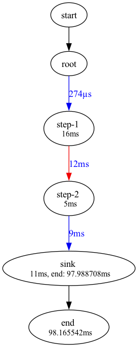

# go-pipeline

[](https://pkg.go.dev/github.com/askiada/go-pipeline)
[](https://goreportcard.com/report/github.com/askiada/go-pipeline)
[](https://github.com/askiada/go-pipeline/actions/workflows/go.yml)

go-pipeline is a Go library for building data-processing pipelines with composable steps, splitters, mergers, and sinks.

## Table of contents
- Overview
- Features
- Requirements
- Installation
- Quick start
- Splitter and merger example
- Step types and when to use them
- Examples
- Pipeline options (metrics + drawer)
- Testing
- Linting
- Documentation
- Contributing
- Support
- Release & versioning
- License

## Overview
The pipeline package provides a channel-based, concurrent processing model with structured error handling. Each step processes inputs and forwards outputs to the next step, allowing fan-out (splitter), fan-in (merger), and final sinks.

## Features
- Generic steps: one-to-one, one-to-many, and channel-based step functions.
- Fan-out and fan-in via splitters and mergers.
- Concurrency and buffering controls via step options.
- Error propagation that stops the pipeline on the first error.
- Optional metrics collection and Graphviz-ready drawer output.

## Requirements
- Go 1.24 (per `go.mod`).
- Graphviz `dot` if you run `make unit_test` or want to render `.dot` files into images.

## Installation
```bash
go get github.com/askiada/go-pipeline
```

## Quick start
```go
package main

import (
	"context"
	"fmt"
	"log"

	"github.com/askiada/go-pipeline/pkg/pipeline"
)

func main() {
	ctx := context.Background()
	pipe, err := pipeline.New(pipeline.PipelineDefaults{})
	if err != nil {
		log.Fatal(err)
	}

	root := pipeline.Root(pipe, "root", func(ctx context.Context, out chan<- int) error {
		for i := range 5 {
			out <- i
		}
		return nil
	})

	double := pipeline.OneToOne(pipe, "double", root, func(ctx context.Context, in int) (int, error) {
		return in * 2, nil
	}, pipeline.StepConcurrency[int](2))

	pipeline.Sink(pipe, "print", double, func(ctx context.Context, in int) error {
		fmt.Println(in)
		return nil
	})

	if err := pipe.Run(ctx); err != nil {
		log.Fatal(err)
	}
}
```
Construction errors are deferred until `pipe.Run(ctx)` so you can wire the pipeline without per-step error checks. `pipe.Err()` is available if you want a preflight check before running.

## Pipeline defaults
Pass `PipelineDefaults` as a pipeline option to set step concurrency, buffers, and splitter buffering:
```go
defaults := pipeline.PipelineDefaults{
	StepConcurrency:    4,
	StepBufferSize:     16,
	StepKeepOpen:       false,
	SplitterBufferSize: 4,
}

pipe, err := pipeline.New(defaults)
if err != nil {
	log.Fatal(err)
}
```

## Splitter and merger example
```go
package main

import (
	"context"
	"fmt"
	"log"

	"github.com/askiada/go-pipeline/pkg/pipeline"
)

func main() {
	ctx := context.Background()
	pipe, err := pipeline.New(pipeline.PipelineDefaults{})
	if err != nil {
		log.Fatal(err)
	}

	root := pipeline.Root(pipe, "root", func(ctx context.Context, out chan<- int) error {
		for i := range 5 {
			out <- i
		}
		return nil
	})

	step1 := pipeline.OneToOne(pipe, "step-1", root, func(ctx context.Context, in int) (int, error) {
		return in + 1, nil
	})

	splitter := pipeline.Split(pipe, "split", step1, 2)

	left, _ := splitter.Get()
	right, _ := splitter.Get()

	leftOut := pipeline.OneToOne(pipe, "left", left, func(ctx context.Context, in int) (int, error) {
		return in * 10, nil
	})

	rightOut := pipeline.OneToOne(pipe, "right", right, func(ctx context.Context, in int) (int, error) {
		return in * 100, nil
	})

	merged := pipeline.Merge(pipe, "merge", leftOut, rightOut)

	pipeline.Sink(pipe, "print", merged, func(ctx context.Context, in int) error {
		fmt.Println(in)
		return nil
	})

	if err := pipe.Run(ctx); err != nil {
		log.Fatal(err)
	}
}
```

## Step types and when to use them
Use `OneToOne` when each input item maps to a single output item. Use `OneToMany` when each input item should expand into multiple output items (fan-out).

### OneToOne vs OneToMany
- `OneToOne`: transform one input into one output (map/transform).
- `OneToMany`: expand one input into many outputs (fan-out or split).

### Per-step concurrency
Use `pipeline.StepConcurrency[...]` on `OneToOne`, `OneToMany`, `FromChan`, and sink steps to control worker concurrency.

### Channel closing behavior
By default, the library closes step output channels when a step finishes, including when using `FromChan`. To keep a channel open, pass the keep-open option (for example, `pipeline.StepKeepOpen[...]()`).

## Thread safety
Build the pipeline before calling `Run(ctx)`; avoid mutating steps while a run is in progress.

## Examples
- Quick start: `go run ./examples/quick-start`
- Splitter + merger: `go run ./examples/splitter-merger`
- Metrics + drawer: `go run ./examples/metrics-drawer`



## Pipeline options (metrics + drawer)
You can attach pipeline options to collect metrics and emit Graphviz-ready output:

```go
package main

import (
	"github.com/askiada/go-pipeline/pkg/pipeline"
	"github.com/askiada/go-pipeline/pkg/pipeline/drawer"
	"github.com/askiada/go-pipeline/pkg/pipeline/measure"
)

func buildPipeline() (*pipeline.Pipeline, error) {
	msr := measure.NewDefaultMeasure()
	drw := drawer.NewSVGDrawer("pipeline.dot")

	return pipeline.New(
		pipeline.PipelineDefaults{},
		measure.PipelineMeasure(msr),
		drawer.PipelineDrawer(drw, msr),
	)
}
```
Run `dot -Tpng pipeline.dot -O` if you want to render the output file as an image.

## Testing
```bash
make unit_test
```

## Linting
```bash
make lint
```

## Documentation
- `docs/README.md` explains the docs layout.
- `docs/diagnoses.md` tracks repo health checks over time.
- `docs/qa/test-plan.md` lists QA scenarios and implemented tests.

## Contributing
See `CONTRIBUTING.md` and `CODE_OF_CONDUCT.md`.

## Support
Please use GitHub Issues for all questions and communication.

## Release & versioning
This project uses SemVer tags and GitHub Releases.

## License
MIT. See `LICENSE`.
